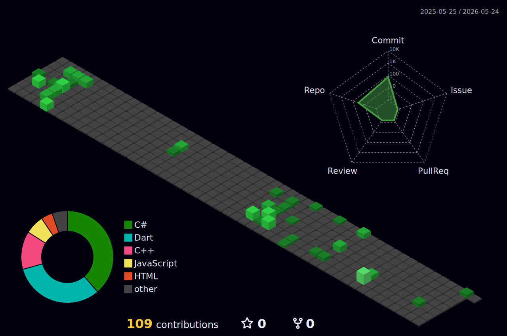

## Hello, I'm detla!

I am a developer focused on learning and building real applications.

### Currently exploring:
   
---

I enjoy working across different areas of development and combining them into complete projects.

